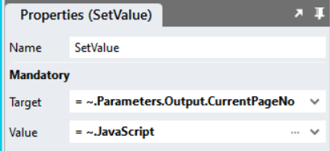

# Set DataGrid Page

https://github.com/stadium-software/datagrid-set-page/assets/2085324/d5dd57c9-f972-491a-a66a-e33eec752394

This sample contains two scripts: 

1. SetDataGridPage: A script that you can use to load a specific DataGrid page
2. GetDataGridSelectedPage: A script that returns the currently selected page of a DataGrid

## Application Setup
Check the *Enable Style Sheet* checkbox in the application properties

## Database, Connector and DataGrid

Use the instructions from [this repo](https://github.com/stadium-software/samples-database) to setup the database and DataGrids for this sample

## SetDataGridPage Global Script Setup

1. Create a Global Script and call it "SetDataGridPage"
2. Add the input parameters below to the script
   1. DataGridClass
   2. PageNo
3. Drag a Javascript action into the script and paste the Javascript below unaltered into the action
```javascript
let dgClass = "." + ~.Parameters.Input.DataGridClass;
let table = document.querySelector(dgClass + " table");
if (!table) table = document.querySelector(".data-grid-container table");
let target = ~.Parameters.Input.PageNo;
let current = document.querySelector(dgClass + " .pagination .active a").textContent;
let steps = calculateSteps(current, target);
let options = {
        childList: true,
        subtree: true,
    },
    observer = new MutationObserver(navigateToPage);

function navigateToPage() {
    observer.disconnect();
    let next = document.querySelector(dgClass + " .pagination li:last-child a");
    let previous = document.querySelector(dgClass + " .pagination li:first-child a");
    if (steps > 0 && next) {
        next.click();
        steps--;
        observer.observe(table, options);
    } else if (steps < 0 && previous) {
        previous.click();
        steps++;
        observer.observe(table, options);
     } else {
        let arr = document.querySelectorAll(".pagination li a");
        for (let i = 0; i < arr.length; i++) {
            if (arr[i].textContent == target) {
                arr[i].click();
            }
        }
    }
}
function calculateSteps(c, t) {
    t = Math.ceil(t / 10) * 10;
    c = Math.ceil(c / 10) * 10;
    let x = t - c;
    return x / 10;
}
navigateToPage();
observer.observe(table, options);
```

## Page Setup

1. Drag a *DataGrid* control to the page (if you don't already have one)
2. Add a class to identify the DataGrid *Classes* property (e.g. datagrid-page-navigate)

## Loading a specific DataGrid Page

1. Drag the "SetDataGridPage" script into any event handler
2. Complete the input parameters
   1. DataGridClass: The class you assigned to the DataGrid (e.g. datagrid-page-navigate)
   2. PageNo: The page you wish to display in the DataGrid

## GetDataGridSelectedPage Global Script Setup

1. Create a Global Script and call it "GetDataGridSelectedPage"
2. Add the input parameters below to the script
   1. DataGridClass
3. Add the output parameters below to the script
   1. CurrentPageNo
4. Drag a Javascript action into the script and paste the Javascript below unaltered into the action
```javascript
let dgClass = "." + ~.Parameters.Input.DataGridClass;
let table = document.querySelector(dgClass + " table");
if (!table) table = document.querySelector(".data-grid-container table");
return table.querySelector(".pagination .active a").textContent;
```
1. Drag a *SetValue* action below the *Javascript* action and set the properties
   1. Target: Select the *CurrentPageNo* in the *ScriptOutputParameters* category in the property dropdown
   2. Value: The return value from the JavaScript action (= ~.JavaScript)



## Reloading the current DataGrid page

1. In an Event Handler, first drag in the *GetDataGridSelectedPage* script
2. Enter the *DataGridClass* in the corresponding input parameter (e.g. datagrid-page-navigate)
3. Fetch the data (e.g. execute the query or call an API)
4. Use a *SetValue* to assign the data to the Datagrid
5. Drag the *SetDataGridPage* script under the *SetValue*
6. Enter the input parameters
   1. DataGridClass: The class you assigned to the DataGrid (e.g. datagrid-page-navigate)
   2. PageNo: The ouput of the *GetDataGridSelectedPage* script
